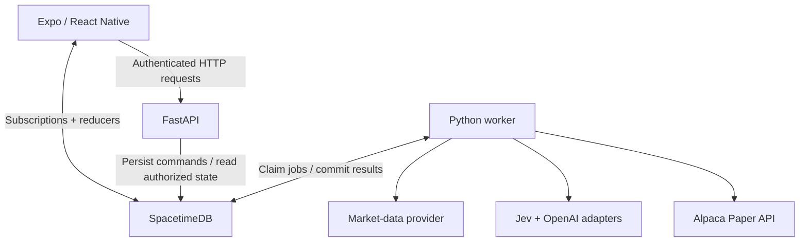

# Orbit — Product Requirements Document

**Version:** 2.0 · SpacetimeDB realtime architecture  
**Date:** October 3, 2026  
**Stage:** MHacks MVP, designed to continue as a product  
**Design status:** Figma wireframing is complete. Existing wireframes are the implementation reference.

## 1. Product definition

Orbit is an AI-first investing companion for beginners. It understands current market activity and the user's investing preferences, surfaces relevant stocks, explains why they matter in simple language, and lets users practice through paper trading.

The core journey is **Discover → Understand → Practice**.

The product should help a beginner answer three questions:

1. What is happening with this company?
2. Why is it relevant to my interests and risk preferences?
3. What happens if I try investing with virtual money?

Celestial imagery and optional zodiac personalization are branding and visual identity. Zodiac must have zero influence on financial scores, eligibility filters, or recommendation ranking.

### Success criteria

- A new user can complete onboarding, understand a relevant stock, and submit a paper order through one coherent flow.
- Recommendations have observable market evidence and user-fit reasons.
- Portfolio and order changes appear through SpacetimeDB subscriptions without manual refresh.
- Market data freshness, order status, and the use of virtual money are understandable.
- The core ranking and paper trading workflows remain functional when OpenAI is unavailable.

These are product requirements, not claims of validated investment performance.

## 2. Scope and priorities

| Priority | Deliverable | Boundary |
|---|---|---|
| P0 | Existing Figma onboarding and navigation | Capture investment profile; preserve established visual identity |
| P0 | Personalized discovery | Three primary stock matches from a small, configurable universe |
| P0 | Stock intelligence | Company summary, why matched, market signals, supported positives/risks, sources |
| P0 | Paper trading and portfolio | Buy, sell, balance, positions, order history, P&L |
| P0 | SpacetimeDB state layer | Persistent state, authorized mutations, subscriptions, reconnect recovery |
| P1 | Ask Orbit | Tool-grounded explanation and multi-step discovery; user-confirmed paper orders |
| P1 | Watchlist and concise market brief | Reuse market and intelligence results |
| P1 | PostHog instrumentation | Measure the complete discovery-to-practice journey |
| P2 | ASI/Agentverse integration | Optional adapter after the core flow works |
| P2 | Richer discovery visualization | Only where compatible with existing Figma and remaining time |

Start with approximately 10–20 supported liquid US equities; make the universe configurable. Expansion toward 100 stocks follows working ingestion and a measured API budget.

Real-money trading, brokerage onboarding, KYC, bank funding, Plaid, social feeds, trading competitions, complex charting, options, leverage, and short selling are outside the MVP.

Prize eligibility and submission rules belong in a separately verified event checklist. Sponsor integrations must not become dependencies of the core journey.

## 3. Figma implementation contract

Figma wireframes already exist. Do not start a new wireframing phase, invent a new navigation hierarchy, or replace the current screens with a new constellation concept by default.

Before UI implementation, map each actual Figma frame to its data, actions, and states. The Figma file itself was not supplied with this PRD; screen names below describe capabilities, not verified frame names.

| Existing screen capability | Required data | Required actions |
|---|---|---|
| Onboarding | Draft answers, saved profile | Complete/update profile |
| Home/discovery | Current recommendation generation, brief, quotes | Open stock, refresh matches, save stock |
| Stock detail | Signals, user-fit reasons, explanation, evidence | Explore sources, ask a question, start paper trade |
| Ask Orbit | Conversation, tool progress, cited answers | Send message, review a proposed trade |
| Trade review/confirmation | Side, quantity/notional, quote timestamp, cash/holdings | Explicitly confirm or cancel |
| Portfolio | Account summary, positions, orders | Inspect position, sell, inspect status |

Implement loading, empty, insufficient-data, stale-data, disconnected, error/retry, submitted, partially-filled, filled, and rejected states. Add these states within the existing design system.

Preserve celestial branding, clean typography, accessible contrast, consistent spacing, native-feeling controls, and existing motion intent. Honor reduced-motion settings. Graphs and celestial visuals must also have readable text equivalents.

Do not display invented match percentages. If a 0–100 fit score is shown, label it a heuristic match score, not a likelihood of making money.

## 4. Technology stack and ownership

| Layer | Technology | Responsibility |
|---|---|---|
| Mobile | React Native, TypeScript, Expo, Expo Router | Existing Figma UX and native device integration |
| Local state | Zustand | Onboarding drafts, selection, modal state, temporary inputs |
| Realtime application state | SpacetimeDB, TypeScript server module | Persisted profiles, recommendations, jobs, watchlists, conversations, paper-state projections |
| Realtime client | SpacetimeDB TypeScript SDK and generated bindings | Authorized subscriptions and reducer calls |
| Intelligence/API | FastAPI, Python | Market ingestion, classification orchestration, scoring, explanations, Alpaca integration |
| Background work | Python worker, shared backend code | Durable jobs, periodic ingestion, retries, reconciliation |
| Authentication | SpacetimeAuth/OIDC, subject to device validation | Stable user identity and authenticated service access |
| Market data | Finnhub for quotes, profiles, exchange status, and holidays; Alpaca Market Data for historical daily bars | Quotes stay separate from daily history. Alpaca data uses `data.alpaca.markets` only and does not enable trading |
| Semantic classification | Jev behind adapter | Structured news/event judgments |
| Communication | OpenAI through adapter | Grounded summaries and conversation |
| Execution | Alpaca Paper Trading through adapter | External simulated orders and account state |
| Analytics | PostHog | Behavioral events and product metrics |

Supabase Postgres and Supabase Auth are removed from the default architecture. Do not maintain duplicate authoritative user-state databases.

**Responsibility contract:** Finnhub supplies quotes and exchange reference data; Alpaca Market Data supplies historical daily bars; Jev classifies text; Python computes financial features and rankings; OpenAI explains; Alpaca Paper owns its paper execution results; SpacetimeDB persists and synchronizes Orbit application state. Historical market data and paper trading use separate hosts.

## 5. System architecture



The mobile app connects directly to SpacetimeDB for application state and ordinary mutations. It may call FastAPI for bounded computation, chat submission, or trade submission; durable state still arrives through subscriptions.

External provider credentials stay in the backend. Reducers must remain short and transactional; market requests, LLM work, and Alpaca network calls happen outside database transactions.

**MVP integration choice:** Python reads worker-authorized views and invokes reducers through the documented HTTP API, behind a `SpacetimeGateway` adapter. This is a deliberate low-volume MVP choice, not a claim that the HTTP interface is the highest-performance path. The official HTTP documentation describes these endpoints as primarily intended for management/debugging and less optimized than the SDK WebSocket protocol. If throughput becomes material, replace the gateway transport with a small TypeScript SDK bridge without changing product logic.

Procedures may be considered later if the pinned server/language version is verified. The MVP does not require SpacetimeDB procedures, custom HTTP handlers, or a synchronous SpacetimeDB → FastAPI call chain.

## 6. State authority and boundaries

| Data | Authoritative producer | Durable Orbit location | Client consumption |
|---|---|---|---|
| Profile/preferences/watchlist | Authorized user reducers | Private SpacetimeDB tables | Caller-scoped views |
| Quotes/news | Market provider; normalized by Python | Bounded snapshots and evidence records | Approved shared projection |
| Quant features and ranks | Python | Versioned feature/recommendation records | Recommendation/detail subscriptions |
| Semantic labels | Jev; schema validated by Python | Classification/event records | Supported evidence projection |
| Explanation text | OpenAI or deterministic fallback | Versioned explanation records | Subscription |
| Alpaca orders/fills/account state | Alpaca | Reconciled paper-state projection | Caller-scoped views |
| Job status/conversation state | Backend and authorized reducers | Private SpacetimeDB tables | Caller-scoped views |

SpacetimeDB is Orbit's application-state authority. It does not become the source of truth for external fills merely because it mirrors them.

Do not calculate portfolio cash, P&L, scores, or trade success independently in Zustand. Do not hold a second server-state cache in TanStack Query for data already subscribed from SpacetimeDB. Retain TanStack Query only for genuinely one-shot HTTP results, if needed.

## 7. Authentication and authorization

Default target: SpacetimeAuth with an OIDC login flow that is validated on the actual Expo/iPhone build. A Google sign-in option can be added through the selected provider after redirect and token handling work.

- Use stable SpacetimeDB `Identity` ownership for user records.
- User reducers derive ownership from authenticated caller context; a client-supplied `user_id` is never authorization.
- Keep user profiles, recommendations, jobs, chat, paper accounts, positions, and orders in private tables.
- Expose caller-scoped views using indexed identity lookups. A public view may expose only the caller's authorized projection; the underlying user table stays private.
- A frontend `WHERE user_id = ...` filter is not a security boundary.
- Worker views and ingestion/result reducers must check an allowlisted service identity. A logged-in consumer cannot publish quotes, scores, fills, or another user's results.
- Bind FastAPI requests to the verified issuer/subject and corresponding SpacetimeDB identity. Validate issuer, audience, signature, expiry, and token type; never trust a body-provided identity or an unverified JWT.
- Prove the OIDC-to-SpacetimeDB mapping during Phase 0. Do not improvise an identity hash or assume all provider access tokens have the required claims.
- Save supported session credentials in secure device storage; clear subscriptions and private caches on logout/account switch.

If using server-issued anonymous identities for an early prototype, persist the original identity token securely and label this as a device-bound guest session. It is not cross-device account recovery. It also needs a validated backend authentication path before protected HTTP operations are enabled.

## 8. Realtime subscription requirements

Use one managed connection per signed-in app session and generated module bindings. Pin compatible CLI, module, and client versions after Phase 0 succeeds.

Suggested subscriptions:

- Session scope: own profile/preferences, current recommendation generation, watchlist, account summary, active jobs.
- Stock detail scope: selected ticker's quote, latest signals, events, and explanation.
- Portfolio scope: own positions and bounded recent orders.
- Chat scope: active conversation messages and progress.

Do not subscribe to every table, every historical snapshot, or every user's state. Remove screen-specific subscriptions when no longer needed.

On launch, wait for subscription application before treating an empty local cache as an empty account. On foreground/reconnect, restore the session, reapply required subscriptions, and wait for authoritative state before enabling order submission.

The SDK client cache is a projection of subscribed server state; it is not automatically a durable offline database. If offline read persistence is added, store a minimal timestamped snapshot separately and keep it read-only.

Show connection/freshness states. Do not silently queue paper trades offline. Prevent duplicate row listeners and stale account data after reconnect or logout.

## 9. Durable command and job model

Long-running work uses persisted jobs. FastAPI `BackgroundTasks` or in-memory queues alone are insufficient for work that must survive process restarts.

Typical job types: `refresh_recommendations`, `generate_explanation`, `answer_message`, `submit_paper_order`, `reconcile_paper_account`.

Job states: `queued → running → succeeded`, with `retry_wait` and terminal `failed` alternatives.

Each job records `job_id`, `owner_identity`, `kind`, `request_key`, `input_version`, `status`, `attempt_count`, `lease_owner`, `lease_until`, `available_at`, bounded payload/reference, timestamps, result reference, and safe error code.

1. An authorized reducer validates and stores a command/job with an idempotency key.
2. A worker reads eligible jobs through a service-authorized view.
3. A claim reducer atomically verifies eligibility and grants a lease.
4. The worker performs external calls outside the transaction.
5. A result reducer verifies the lease, input version, owner, and idempotency key before committing results.
6. Subscriptions notify the app of committed results.

For the MVP, run one worker with configurable bounded polling, initially around one second, backoff, and a small concurrency limit. Each worker view uses indexed status buckets rather than unrestricted private-table scans.

Use configurable attempt limits and exponential backoff with jitter. Expired leases can be reclaimed. Duplicate refresh requests coalesce. External timeouts after order submission require provider reconciliation, not blind resubmission.

## 10. Market-data ingestion

FastAPI/backend workers own all market-data communication. Mobile does not call market or AI providers directly.

Finnhub remains the quote, profile, and exchange-calendar source. Historical daily OHLCV comes from Alpaca Market Data (`data.alpaca.markets`), approved on 2026-10-03 because the configured Finnhub plan returns HTTP 403 for daily candles. That data host is separate from Alpaca paper trading (`paper-api.alpaca.markets`) and cannot submit orders. Prefer consolidated SIP history. If only IEX is available, record that its volume is not consolidated market volume and do not mix the two feeds.

Required inputs: recent quote, split-adjusted historical closes and volume where available, company news, and market/sector benchmarks where supported.

The provider adapter reports capabilities and unavailable fields. Verify the actual Finnhub subscription for quotes, news retention, and reference data, and verify which Alpaca history feed the account can read. Do not promise paid-tier data through a free key.

Store timestamps separately: provider event time, ingestion time, computation time, and publication time. Use UTC in storage; format for the user's timezone in UI. Preserve exchange calendar semantics for daily bars.

Configurable starting cadence: daily historical bars after a completed session; news polling every several minutes; selected-ticker quotes more frequently when provider limits allow. Push each accepted database change to connected clients.

**Realtime state delivery does not imply exchange-tick market data.** UI must identify the actual source, market-open/closed status, and data timestamp. Weekend demo prices may be the latest available closing quotes.

Validate duplicates, malformed data, splits, missing bars, zero denominators, future timestamps, and stale quotes before scoring or trading.

## 11. Jev semantic intelligence

Use Jev for narrow, structured classifications of articles/events. It must not set trend scores, prices, risk thresholds, or ranking weights.

Input: ticker, headline, supported summary/text, source, publication time, and article identifier.

Expected output:

```json
{
  "relevant": true,
  "relevance_score": 0.94,
  "event_type": "earnings",
  "sentiment": "positive",
  "materiality": "high",
  "keep": true
}
```

Allowed event types: earnings, product, partnership, regulation, M&A, analyst_rating, executive, legal, macro, financing, other. Sentiment: positive/neutral/negative. Materiality: low/medium/high/critical.

Validate enums, score bounds, schema version, and provider response shape in Python. Cache classification by article-content hash, ticker, and classifier version. Deduplicate syndicated news and cluster related events before counting evidence.

Jev is a planned adapter dependency, not a verified API contract in this document. Validate credentials, SDK/API, structured output, latency, and quotas early. On failure, omit unavailable semantic features and explain reduced coverage; do not silently substitute OpenAI for Jev.

## 12. Quantitative features

Python remains the financial calculation authority. Implement deterministic features before learned models.

### Relative price momentum

Use completed trading-day returns at 1, 5, and 20 days:

```text
R_h = P_t / P_(t-h) - 1
RelativeReturn_h = StockReturn_h - BenchmarkReturn_h
MomentumRaw = 0.20*RelativeReturn_1d
            + 0.50*RelativeReturn_5d
            + 0.30*RelativeReturn_20d
```

Use the sector benchmark when available; otherwise a documented broad-market fallback. Do not silently mix adjusted stock closes with unadjusted benchmark history.

### Volatility-adjusted momentum

```text
RealizedVol_20 = std(daily returns over 20 completed trading days)
VolAdjustedMomentumRaw = MomentumRaw / max(RealizedVol_20, epsilon)
```

Use consistent daily units, a configured epsilon, and an explicit minimum history count. Annualization, if used for risk display, is separate and documented.

### Abnormal volume

```text
VolumeRatio = CompletedDailyVolume / mean(previous 20 daily volumes)
VolumeRaw = log(max(VolumeRatio, epsilon))
```

Never compare incomplete intraday cumulative volume with a full-day baseline. Intraday scoring requires a comparable time-of-day baseline and is deferred unless that dataset exists.

### News velocity

```text
NewsRaw = (CurrentRelevantEventCount - HistoricalMean) / max(HistoricalStd, epsilon)
```

Use comparable fixed windows, initially 24 hours, and a configurable 30–60 day baseline. Count deduplicated relevant kept events. A missing historical news baseline makes this feature unavailable; do not invent one.

### Sentiment shift

Map positive to +1, neutral to 0, negative to -1. Weight by relevance, recency, and optional fixed materiality:

```text
weight_i = relevance_i * exp(-ln(2)*age_i/half_life) * materiality_weight_i
RecentSentiment = sum(sentiment_i*weight_i) / sum(weight_i)
SentimentShiftRaw = RecentSentiment - HistoricalSentimentBaseline
```

Age and half-life use the same units. Zero total weight means unavailable sentiment, not fabricated neutrality.

### Source breadth and materiality

```text
BreadthRaw = log(1 + IndependentSourceCount)
Materiality: low=0.25, medium=0.50, high=0.75, critical=1.00
BreadthMaterialityZ = 0.50*BreadthZ + 0.50*MaterialityZ
```

Use distinct event clusters and credible source lineage; republished copies are not independent corroboration. The Python configuration owns these mappings.

## 13. Normalization and Trend Score

Normalize comparable feature observations using only prior historical data:

```text
z = clip((x - prior_rolling_mean) / max(prior_rolling_std, epsilon), -3, 3)
```

Initial baseline target: approximately 60 completed trading days for appropriate daily features. News uses comparable news windows. Each feature has a configured minimum sample count.

Initial weights:

| Feature | Weight |
|---|---:|
| Relative momentum | 0.25 |
| Volatility-adjusted momentum | 0.10 |
| Abnormal volume | 0.20 |
| News velocity | 0.20 |
| Sentiment shift | 0.10 |
| Breadth/materiality | 0.15 |

```text
Composite = sum(weight_i * feature_z_i)
TrendScore = 100 / (1 + exp(-Composite))
```

The presentation mapping and all weights are configurable starting heuristics, not scientifically validated settings.

Track missingness explicitly. For an available subset, renormalize available weights to sum to one and store `coverage = sum(original_available_weights)`. Initial publication gate: momentum and volume available, sufficient history, and coverage at least 0.55. This gate is also a configurable heuristic. Below it, show insufficient data rather than a fabricated full score.

Store the available-feature mask and coverage with every score. Do not compare low-coverage scores to full scores without applying a defined coverage policy; first rank within a coverage tier and explain limitations.

A Trend Score of 95 is **not a 95% probability of a stock rising**. The signed composite blends positive relative momentum/sentiment with unusual activity. It is not a direction-neutral measure of all attention: strong negative activity may receive a low score. Expose movement direction and notable negative events separately so beginners still see material risks.

Never label this Investment Score, Buy Score, or Probability of Going Up.

## 14. User fit and personalized ranking

Capture risk tolerance, investment horizon, style, sector interests, experience, and goal using the established Figma onboarding. Optional zodiac answers affect presentation only.

Initial profile values: conservative/moderate/aggressive risk; weeks/months/years horizon; growth/value/income/balanced style.

```text
FitScore = 100 * (0.40*RiskMatch + 0.30*HorizonMatch
               + 0.20*StyleMatch + 0.10*SectorPreference)
RecommendationRank = 0.60*TrendScore + 0.40*FitScore
```

Fit components range from 0 to 1. Keep Trend Score, Fit Score, and rank distinct internally and on a compatible 0–100 scale before combining.

`fit-v1.0.0` (2026-10-03) scores only the components the stored data can support. Risk match uses 20-session realized volatility and up to 60 sessions of peak-to-trough drawdown from the same daily-bar source as the Trend Score. Sector preference uses the saved interests and the stock’s universe sector. Horizon match and style match stay in the formula with their original weights, but they are marked unavailable: daily momentum is not treated as long-term suitability, and no valuation, dividend, or growth fundamentals are stored, so stocks are not labeled growth, value, or income. Experience and goal change explanation wording only. Available weights are renormalized and coverage keeps the sum of the original available weights (0.50 when risk and sector are both scored, 0.10 when the user set no volatility ceiling). Zodiac is not an input.

Apply supported-symbol, data-quality, and risk-eligibility filters before ranking. High trend must not override an explicit risk constraint. Conservative and moderate profiles exclude names above a documented volatility ceiling or drawdown floor; aggressive sets no ceiling and does not treat higher recent volatility as a better match. Break ties deterministically by fit, data freshness, then ticker. Prefer sector variety among the top three when it does not violate constraints and the rank gap stays within 15 points.

For agent requests involving portfolio concentration, read current holdings and apply an explicit configurable exposure rule. If no acceptable candidates exist, explain that instead of relaxing constraints silently.

Produce structured reasons and `profile_version`, `portfolio_version`, `market_snapshot_id`, and `algorithm_version`. Present “Trending for you” and readable match reasons rather than implying suitability has been professionally established.

## 15. Recommendation publication

1. Completing or updating the profile creates a refresh job.
2. Python loads the authorized profile and current data, computes candidates and reasons, and creates a new generation.
3. Optional explanation generation adds supported prose; deterministic text is immediately usable.
4. A publish reducer validates input versions and atomically switches the user's current-generation pointer.
5. The app receives the complete new recommendation set through subscriptions.

Do not show a mixed generation while rows are being written. For larger batches, stage rows first and switch the pointer only when complete. Reject a stale result if preferences changed while the worker was running; queue a fresh job.

Retain the previous usable generation during refresh, with an “Updating” state and timestamp. Refreshes are rate-limited and use cached shared signals rather than re-ingesting every ticker for every user.

## 16. OpenAI explanations and Ask Orbit

OpenAI receives structured backend evidence and explains it. It does not produce authoritative prices, balances, numeric scores, rankings, or execution results.

Outputs: one-line company/activity summary, “Why this fits you,” supported positive factors and risks, concise market brief, and conversational answers.

Each factual explanation uses source IDs tied to stored evidence URLs and dates. Numerical claims must match structured inputs. Avoid filling a three-item bull/bear template with unsupported claims; fewer supported points are preferable.

Example tools: `get_user_profile`, `get_portfolio`, `get_stock_signals`, `get_recent_events`, `find_matching_stocks`, `prepare_paper_order`.

Multi-step example: interpret constraints → inspect profile/holdings → retrieve candidates → apply deterministic filters/ranking → explain alternatives → prepare a trade review.

Paper execution requires explicit confirmation of ticker, side, quantity/notional, account, and reviewed quote. A chat message or tool call alone must not bypass the confirmation boundary.

Persist messages and coarse progress such as “Checking your portfolio” or “Comparing candidates.” Do not expose model chain-of-thought. Enforce bounded tool steps, timeouts, and per-user budgets.

Treat news and retrieved text as untrusted content, not tool instructions. On LLM failure, use deterministic explanations and leave trading available. Cache prose by relevant input and model/prompt versions.

ASI integration, if pursued, reuses these authorized backend capabilities; it does not create a second ranking engine or bypass identity and trade confirmation.

## 17. Paper trading and account provisioning

Preserve the original Alpaca Paper Trading integration. Use a `PaperTradingProvider` abstraction so execution infrastructure can evolve without rewriting the mobile app.

### Account boundary

An Alpaca paper account is not automatically a separate account for every Orbit user. One shared API key must not be presented as isolated personal portfolios.

- Hackathon execution demo: explicitly bind one provisioned Alpaca paper account to one designated demo user. Additional users can explore discovery; do not enable trading for them without a validated separate account mapping.
- Multi-user continuation: validate an appropriate account/OAuth/Broker sandbox provisioning path and provider permissions before enabling independent portfolios.
- If that path is unavailable, an Orbit-owned simulator is a separate, explicitly documented implementation decision. It must be labeled simulated and must not claim Alpaca execution. It is not silently substituted by this PRD.

The product target is a $10,000 virtual starting balance. Provision and verify the actual provider account balance; do not assume this is Alpaca's default or overwrite provider balances in the UI.

### Order behavior

Initial order scope: supported equities, long-only, market orders. Enable dollar-based/fractional amounts only when the asset and provider support them; otherwise use share quantity. A “+1 share” control changes the draft only.

1. Display a review with side, amount/quantity, timestamped indicative quote, and virtual-money label.
2. Explicit confirmation creates a durable order intent with a stable idempotency/client-order key.
3. Worker validates ownership, account binding, asset support, freshness, cash/holdings, and current provider rules.
4. Worker submits to Alpaca outside the DB transaction.
5. Persist provider order ID/status. Submitted is not filled.
6. Reconcile execution updates and account/position snapshots, then publish a consistent portfolio revision.

States include queued, submitting, submitted, partially_filled, filled, rejected, canceled, and unknown/reconciling. Map actual provider statuses explicitly.

Do not debit cash or declare success optimistically. Use decimal arithmetic or documented fixed-point units for money/quantity; never binary floating-point ledger arithmetic.

If an HTTP timeout occurs after submission, query the provider using the existing order identity before retrying. Prevent duplicate taps and duplicate worker execution from creating extra orders. Concurrent submissions for one account are serialized or otherwise reconciled against provider buying power.

### Reconciliation and market closure

Use provider order updates when validated, with bounded polling as a fallback. A configured interval, initially a few seconds for active orders, does not guarantee immediate fills. Reconcile on startup, reconnect, after orders, and periodically.

Commit coherent account/position snapshots with a revision; ignore obsolete results. Alpaca is authoritative for its cash, fills, holdings, and realized execution values. Mark Orbit-calculated unrealized P&L with the valuation quote/time.

When the market is closed, show that orders may remain pending. For a weekend presentation, prepare an honest recorded market-open fill or a clearly labeled simulator demonstration; do not fabricate live execution.

## 18. SpacetimeDB data model

Entities below are conceptual contracts. Implement indexes, uniqueness, relationship validation, and cleanup explicitly in reducers; do not assume a Postgres foreign-key/RLS migration is automatic.

| Entity | Key fields / indexes | Visibility and purpose |
|---|---|---|
| `users` | identity PK; verified issuer/subject mapping | Private; account binding |
| `user_profiles` / `investment_preferences` | owner identity; profile version | Private; caller view |
| `stocks` | ticker PK; sector | Shared approved metadata |
| `market_snapshots` | snapshot ID; ticker/time; source | Shared bounded quote projection; historical retention bounded |
| `news_articles` / `news_events` | ID; ticker/time; content hash; cluster ID | Private evidence storage; approved detail projection |
| `jev_classifications` | article/ticker/version key | Private; classification provenance |
| `trend_signals` / `trend_scores` | ticker/as-of/version; availability mask | Feature history and current shared projection |
| `recommendation_generations` | generation ID; owner/version | Private; current-generation pointer |
| `recommendations` | generation/ticker key; owner; rank | Private; caller view |
| `explanations` | evidence/input hash; versions; generation | Shared or private according to content |
| `watchlists` | owner/ticker unique key | Private; caller view |
| `conversations` / `chat_messages` | owner; conversation ID; sequence | Private; bounded caller view |
| `jobs` | job ID; owner; status index; request key | Private; caller status and gated worker views |
| `paper_accounts` | owner; provider account ID; revision | Private; no API secrets in client projection |
| `paper_orders` | owner; intent ID; client order key; provider ID | Private; caller status |
| `paper_positions` / `portfolio_summary` | account/ticker; revision | Private; coherent caller projection |
| `recommendation_impressions` | owner/generation/ticker/event key | Optional bounded audit; PostHog handles product analytics |
| `service_config` | config key | Private; worker identities and algorithm versions |

Index owner identity, ticker/time, conversation/sequence, account/ticker, and job eligibility where used. Views require suitable indexed access. Store compact source references and summaries, not unlimited raw provider payloads in subscribed rows.

Persist individual features, not only final scores: raw values, normalized values, baselines, coverage, weights, input references, source/publication/ingestion times, algorithm version, and as-of time.

Bound hot data: latest quotes, current/previous recommendation generations, recent orders/messages, and configured feature history. Archive older point-in-time datasets to durable object storage before pruning when needed for backtesting; object storage is not a second operational database. Define retention against provider licensing and measured memory/storage costs.

## 19. Reducers, views, and API contracts

Names are implementation contracts; generated bindings determine exact SDK syntax.

| Interface | Examples | Allowed caller |
|---|---|---|
| Profile/watchlist reducers | `complete_onboarding`, `update_preferences`, `add_to_watchlist`, `remove_from_watchlist` | Owner derived from caller |
| Command reducers | `request_recommendations`, `enqueue_message`, `create_paper_order_intent` | Authorized user; rate-limited |
| Worker reducers | `claim_job`, `complete_job`, `fail_job`, `publish_market_snapshot`, `publish_recommendations`, `apply_paper_snapshot` | Allowlisted service identity only |
| User views | `my_profile`, `my_recommendations`, `my_watchlist`, `my_jobs`, `my_portfolio`, `my_orders`, `my_messages` | Caller-scoped projection |
| Shared projections | Supported stocks, latest approved market/signals/evidence | Read access consistent with data license |
| Worker views | Eligible jobs and required versioned inputs | Service-gated; return no private data to other callers |

Suggested FastAPI surface:

- `GET /health` — process health; readiness checked separately.
- `POST /assistant/messages` — authenticate, validate, persist message/job, return accepted message/job IDs.
- `POST /paper/orders` — authenticate confirmed intent, persist job, return accepted order/job IDs.
- `POST /recommendations/refresh` — optional HTTP entrypoint to the same durable command path.

For these commands, a 202 response means accepted, not completed. Results are subscribed state. Choose one submission route per mobile action; do not send both a reducer command and an HTTP command independently.

Use schema-validated Python DTOs and generated TypeScript bindings. Contract-test cross-language timestamps, identities, optional fields, numeric units, enums, and version fields. Translate internal errors into stable client error codes.

## 20. Provider abstractions and project layout

Backend interfaces:

- `MarketDataProvider`: `get_quote`, `get_price_history`, `get_company_news`, `get_market_news`, supported benchmarks/capabilities.
- `NewsClassifier`: structured `classify_article` with version and availability.
- `ExplanationProvider`: grounded explanation and bounded tool conversation.
- `PaperTradingProvider`: account, supported assets, submit/find order, orders, positions, execution updates.
- `SpacetimeGateway`: authorized reads, command/result reducers, retry-safe contracts.

Suggested repository areas:

| Path | Responsibility |
|---|---|
| `mobile/app/` | Expo Router routes matching Figma |
| `mobile/src/features/` | Onboarding, discovery, stock detail, assistant, trading, portfolio |
| `mobile/src/realtime/` | Connection lifecycle, subscriptions, generated bindings, selectors |
| `mobile/src/state/` | Local drafts and UI state |
| `spacetime/src/` | Schema, reducers, views, authorization, job leasing, versions |
| `backend/app/market/` | Provider interface and Finnhub ingestion |
| `backend/app/intelligence/` | Jev classification and event processing |
| `backend/app/signals/` | Deterministic feature calculations and normalization |
| `backend/app/ranking/` | Eligibility, fit rubric, recommendation generation |
| `backend/app/llm/` | Evidence-grounded explanation/chat |
| `backend/app/trading/` | Alpaca and reconciliation |
| `backend/app/state/` | Spacetime gateway and DTOs |
| `backend/app/workers/` | Durable jobs and periodic schedules |
| `backend/app/routes/` | Authenticated HTTP command surface |
| `backend/app/config/` | Typed environment and versioned settings |

Do not keep Supabase repositories/ORM models as the hidden default persistence layer.

## 21. Analytics and observability

PostHog events: onboarding_started/completed, recommendations_viewed, recommendation_opened, why_matched_opened, evidence_opened, watchlist_added, paper_order_confirmed/submitted/filled/rejected, portfolio_revisited, assistant_message_sent, recommendation_feedback.

Measure onboarding completion, recommendation CTR, detail/evidence engagement, confirmed-to-filled conversion, portfolio revisit, D1/D7 retention, and assistant usage. A button tap is not a completed trade.

Use stable pseudonymous user IDs and event keys to deduplicate. Avoid raw chat, auth tokens, provider credentials, and sensitive account fields in analytics. Minimize replay capture around private screens.

Operational measurements: ingestion freshness, missing-feature rate, job queue age, provider errors/rate limits, AI cost/latency, subscription/reconnect failures, order reconciliation age, and duplicate-command rejection. Correlate logs by request/job/order ID without logging secrets.

## 22. Implementation order

Figma wireframing is complete; the phases start with integration validation and implementation.

| Phase | Work | Exit condition |
|---|---|---|
| 0 — Integration proof | Pin versions; connect actual Expo/iPhone to SpacetimeDB; subscribe; call reducer; restart/reconnect; validate OIDC, FastAPI identity, private views, Python gateway | Two test identities are isolated; identity survives restart; worker can claim/write; unauthorized clients cannot |
| 1 — State and UI foundation | Existing Figma shell, profile/preferences, views, connection states, durable jobs | Complete onboarding and persist/reload state |
| 2 — Quant foundation | Supported data adapter, historical bars, momentum/volume/volatility, coverage-aware scores | Deterministic signals published and visible live without AI |
| 3 — News intelligence | Jev adapter, validation, deduplication, event labels, available semantic signals | Evidence-linked signals; truthful fallback with missing baselines |
| 4 — Personalized discovery | Explicit fit rubric, constraints, top-three ranking, generation publication, stock detail | End-to-end discover/understand with sourced reasons |
| 5 — Paper execution | Account provisioning proof, order review, durable intents, Alpaca, reconciliation, portfolio | One isolated demo account can buy/sell with correct status and duplicate protection |
| 6 — Explanation and conversation | Cached explanations, market brief, tool-grounded Ask Orbit | No invented facts; confirmed order path reused |
| 7 — Demo and polish | Reconnect/error QA, Figma polish, accessibility, instrumentation, optional sponsor adapter | Coherent demo with honest timestamps and execution status |

Run Alpaca account/provisioning checks during Phase 0 even though UI execution is built in Phase 5. Do not discover this constraint at the end.

If time is short, prioritize P0 and deterministic explanations. Defer elaborate motion, extensive chat, and additional sponsor integrations.

## 23. Acceptance and meaningful verification

### Product and realtime

- Onboarding results persist after relaunch and stay isolated between two identities.
- Changing risk preferences changes eligible candidates/ranking and matching reasons according to the rubric.
- Two sessions for the same account receive the same committed watchlist/portfolio changes without manual refetch.
- Recommendations publish as one generation; older jobs cannot replace newer-profile results.
- Disconnection produces a clear read-only/stale state; reconnect waits for authoritative state and enables actions safely.
- Logout/account switch removes old private data and listeners.

### Intelligence

- Fixed fixtures produce repeatable scores; hand-check representative feature calculations.
- Test zero variance, missing history, splits, duplicate news, future timestamps, and unavailable semantic inputs.
- Trend/fit/rank remain distinct; no UI describes a score as return probability.
- Explanations use actual evidence and reproduce input numbers; provider failures show truthful fallbacks.

### Trading and permissions

- Direct attempts to query another user's state or invoke service reducers are rejected or return no unauthorized data.
- Duplicate tap/retry, lease expiry, worker restart, provider timeout, rejected order, partial fill, and delayed fill do not create extra trades or fabricated cash.
- An accepted order remains pending until the provider reports its outcome.
- Coherent account/position revisions survive out-of-order reconciliation responses.
- No provider secrets appear in the mobile bundle, subscribed projections, or logs.

Suggested MVP performance targets, to be measured rather than promised: current subscribed UI changes within roughly one second of DB commit under demo conditions; useful cached discovery immediately after subscription application; bounded external jobs with visible progress. Measure market ingestion and broker execution latency separately.

## 24. Backtesting, deployment, and continuation

### Backtesting

Preserve point-in-time features, source timestamps, classifications, algorithm versions, coverage, and historical universe membership. Use only data actually available at each decision timestamp. Avoid look-ahead bias, future-news leakage, and survivorship bias.

Later evaluate 1/5/20 trading-day forward outcomes, feature contribution, sector/regime differences, coverage effects, and news improvement over price/volume baselines. Use chronological evaluation and account for costs if evaluating a trading strategy. The current scores are transparent heuristics, not validated predictors.

A future `P(next-5-day return > 0)` model requires separate labels, calibration, and evaluation. Never derive that probability directly from Trend Score.

### Deployment

Deploy the SpacetimeDB module, FastAPI service, and worker as distinct runtime components. Configure approved identities, TLS endpoints, OIDC redirects, provider quotas, secrets, health/readiness, and restart recovery. Keep development/demo/production namespaces and accounts separate.

Use environment-held backend secrets and explicit paper endpoint configuration. Mobile configuration contains only public endpoint/module/auth configuration. Disable live execution in the MVP adapter.

Module schema and generated bindings change together. Verify migration behavior on the pinned SpacetimeDB version, back up/export required state, test upgrades in a separate namespace, and never reset a populated production database merely to fix generated types.

### Validation gates and continuation

| Gate | Decision if validation fails |
|---|---|
| React Native SDK, Hermes/polyfills, reconnect behavior | Resolve in Phase 0; do not assume browser React examples guarantee native compatibility |
| OIDC mobile login and verified backend identity mapping | Choose one supported provider flow before protected commands ship |
| Finnhub history/news capabilities | Adjust provider/plan or explicitly reduce feature coverage |
| Jev structured classification | Keep adapter boundary; ship reduced-coverage deterministic path until verified |
| Python HTTP gateway payloads/permissions | Fix contract or use TypeScript SDK bridge; preserve realtime state architecture |
| Alpaca independent account provisioning | Keep execution restricted to the designated demo account until a valid multi-user model exists |

After the hackathon: validate beginner comprehension and retention; expand the universe and historical datasets; improve scoring through evidence; complete multi-user paper account provisioning; optimize the gateway; investigate real brokerage/funding only as a separate product and integration effort.

### Implementation instructions

Implement this PRD incrementally using the existing Figma wireframes. Explain a major component's role and validate unresolved assumptions before building dependent features. Preserve the responsibility boundaries, type-safe contracts, configurable scoring, individual feature history, authenticated views/reducers, durable jobs, and external execution reconciliation.

The goal is a transparent market-intelligence product that beginners can understand and practice with—not an AI that claims to predict stocks.

## Technical references

The architecture and numeric settings above are Orbit design decisions. These official references support platform capabilities and constraints; they do not validate Orbit's financial heuristics.

- [SpacetimeDB TypeScript client reference](https://spacetimedb.com/docs/clients/typescript/) — SDK, generated bindings, subscriptions and cache; documentation describes browser/Node clients, so native compatibility remains a device-validation gate.
- [SpacetimeDB authentication](https://spacetimedb.com/docs/core-concepts/authentication/) — OIDC, session identity and service authentication; authorization remains module logic.
- [SpacetimeDB table access permissions](https://spacetimedb.com/docs/tables/access-permissions/) and [views](https://spacetimedb.com/docs/functions/views/) — private tables and caller-specific indexed projections.
- [SpacetimeDB HTTP database API](https://spacetimedb.com/docs/http/database/) — query/reducer endpoints and documented performance positioning.
- [SpacetimeDB procedures](https://spacetimedb.com/docs/functions/procedures/) — an optional integration path; not an MVP dependency.
- [Alpaca paper trading](https://docs.alpaca.markets/us/docs/paper-trading) — separate paper credentials/endpoints, simulation behavior, and account/fill limitations.

References reviewed on October 3, 2026. Confirm pinned versions and account capabilities during implementation.
