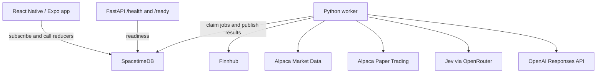

# Orbit

Orbit is a mobile stock discovery and paper-trading app for people who are curious about investing and do not know where to start.

Instead of opening on a ticker search or a screener, Orbit offers a small set of companies to look at, plain-language context for each one, an AI assistant that answers from published market data, and a practice portfolio that uses simulated money.

## Why Orbit

Most investing products assume you already know which company to research, which ticker to type, and which numbers matter.

Orbit is built around a narrower first question: what is worth looking at today, and why might it be interesting?

## Core experience

**Discover → Understand → Ask → Try**

### Discover

The Discover tab shows one set of companies per person per local day. A saved zodiac sign, when the user chose one, picks which corner of a curated market to explore. The companies inside that theme are chosen from quotes, recent news, the investment profile saved during onboarding, and what that person has already been shown.

Reopening Discover the same day shows the same companies, with the latest published prices.

### Understand

A company screen includes the name and sector, a price chart, the quote and its provider timestamp, a short written read of recent price behavior, relevant headlines, and the reasons that company was surfaced. Trend Score, when one has been published, summarizes recent price and volume behavior. It is a market signal, not a forecast.

### Ask

Home is a conversation. Orbit can open with a short daily brief and answer follow-up questions about stocks, matches, and practice trading. The model only sees a packet the server has already assembled. It explains that packet. It does not place orders.

### Try

From a stock screen, the bound practice account can review a buy or sell and confirm it with a swipe. Cash, equity, positions, and unrealized P&L come from an Alpaca paper account. No real money is used.

## Features

- Onboarding for risk, time horizon, style, sectors, experience, and goal, plus an optional zodiac sign
- Daily Discovery: three companies, fixed for the local day, with short factual reasons
- Zodiac theme selection that chooses a market theme and is excluded from every score
- A separate profile ranking (risk and sector fit blended with Trend Score) used in stock explanations and the assistant
- Trend Score from recent relative momentum, volatility-adjusted momentum, and abnormal volume
- Scheduled market ingestion, then live updates in the app through SpacetimeDB subscriptions
- Company news from Finnhub, filtered by a news classifier before it is shown or cited
- Search across the curated universe by ticker, name, industry, or sector
- A device-local watchlist
- Home brief and chat, with the transcript stored privately for that guest
- Paper buy and sell, positions, cash, equity, and unrealized P&L
- In-app notifications for order status, the daily brief, and a ready Discovery set
- Device-bound guest identity, stored in the iOS Keychain

Sign-in and sign-up screens are part of the onboarding flow. This build does not create accounts. Typed credentials are not stored or sent, and the app continues with the guest already on the device.

## Tech stack

| Layer | Technology |
|---|---|
| Mobile | React Native 0.86, Expo SDK 57, TypeScript, Expo Router |
| Mobile state | SpacetimeDB client subscriptions; Zustand for the local watchlist |
| Realtime application state | SpacetimeDB 2.10.2 TypeScript module |
| Worker | Python 3.14 (`uv`), durable jobs claimed from SpacetimeDB |
| HTTP service | FastAPI and Uvicorn, limited to `/health` and `/ready` |
| Quotes, profiles, market status, news | Finnhub |
| Daily price history | Alpaca Market Data (`data.alpaca.markets`), split-adjusted SIP bars |
| Paper trading | Alpaca Paper Trading (`paper-api.alpaca.markets`) |
| News classification | Jev (`typesafe/jev-1.13`) through OpenRouter’s Decisions API |
| Assistant | OpenAI Responses API, model `gpt-4.1-mini` by default |
| Local development | Node 24.15.0, Makefile, npm, uv |

The phone talks to SpacetimeDB. It does not call Finnhub, Alpaca, Jev, or OpenAI, and it does not hold those keys. FastAPI is a liveness and readiness check for the worker’s connection to SpacetimeDB. User actions are SpacetimeDB reducers. A Python worker performs the external calls and writes the results back under a job lease.

## Architecture



SpacetimeDB holds profiles, Discovery sets, recommendations, quotes, daily bars, Trend Scores, news, paper account state, assistant messages, and notifications. Caller-scoped views return only the connected guest’s private rows. Shared market rows (quotes, scores, company news) are public projections. Provider keys stay on the worker.

External calls happen outside database transactions. The worker then publishes a validated snapshot in one reducer call.

## Discovery

Daily Discovery (`discovery-v1.0.0`) runs in the worker after the app calls `request_daily_discovery` with the device’s local date.

1. **Theme.** Each zodiac sign maps to four theme sectors in `backend/app/config/discovery_themes.json`. A guest with no sign uses a fallback list. For a given date and sign, sector and sub-theme order is a hash of that date, sign, and theme id, so the same day always produces the same order. The person’s own history skips yesterday’s sub-theme and avoids repeating a sector too often in a short window.
2. **Candidates.** The chosen sub-theme lists a handful of companies that already belong to the ingestion universe. A company without a valid quote is skipped. If fewer than two companies are priced, the worker moves to the next theme in that day’s order.
3. **Ranking.** Available components are combined and renormalized:

   `0.30` Trend Score · `0.25` personal fit · `0.20` recent company news · `0.15` recent momentum · `0.10` novelty

   A shorter time horizon shifts a little weight toward momentum. A longer horizon shifts a little toward fit. Personal fit compares curated company traits with the saved profile. Those traits are hand-written heuristics, not financial statements. Novelty is lower when the person has already seen the company.
4. **Selection.** Up to three companies are kept. Names shown in the last week are held back while newer names remain, and a later card can take a different angle when its score is close.

The sign chooses the theme. It is stored apart from the investment profile and is not an input to Discovery Score, Trend Score, or the profile ranking. Company facts come from market data, news, and the curated universe.

A second ranking, `fit-v1.0.0`, still runs when a profile is saved. It blends the published Trend Score with a fit score from realized volatility, drawdown, and sector preference, and it drops names that miss a conservative or moderate risk ceiling. Horizon and style are recorded as unscored. That ranking feeds stock-detail notes and the assistant. The Discover tab is the daily theme set, not this list.

## Trend Score

Trend Score (`trend-v1.0.0`) is a 0–100 summary of recent market behavior for one completed session.

For each stock, the worker compares split-adjusted daily closes with that stock’s sector ETF (SPY if the sector benchmark is missing):

- relative momentum over 1, 5, and 20 sessions
- that momentum divided by 20-session realized volatility
- abnormal volume, as the log ratio of the latest completed-session volume to the prior 20 sessions

Each feature is turned into a z-score using only earlier observations, clipped, and combined. The composite is mapped into 0–100. A score is published only when momentum and volume are both available and coverage is high enough.

News features exist in the formula and are left unpublished. There is no long-run news baseline in ingestion, so current scores use price and volume only.

Trend Score measures how unusual recent trading has been relative to a benchmark and to the stock’s own history. It is not a probability, a price target, or a buy or sell recommendation.

## AI assistant

Home requests a daily brief and sends chat through SpacetimeDB. The worker claims `home_brief` and `answer_message` jobs, loads evidence for that guest, and calls the OpenAI Responses API from the server. The API key never reaches the app. If the key is missing, the assistant still answers from the published data with deterministic copy.

The evidence packet can include:

- quotes, previous closes, provider timestamps, and source
- returns over recent windows, computed from stored bars and the latest quote
- whether the practice account holds the company
- recommendation reasons and Trend Score, with an explicit definition of what the score measures
- up to three company headlines, plus Jev labels (event type, sentiment, materiality) when classification succeeded
- market open or closed, and the last completed session

The prompt treats user text and headlines as data. Replies are checked before they are stored: invented figures, buy or sell directives, and claims that go beyond the packet are rejected, and a fallback answer is kept instead. The model has no tools that can change state or submit an order.

Messages live in a private table. The app reads them through a view keyed to the caller. Clearing the chat removes that guest’s transcript.

## Paper trading

Practice orders go to Alpaca’s paper API. The backend rejects any Alpaca host other than `paper-api.alpaca.markets` for trading, and it uses `data.alpaca.markets` only for historical bars. Those two hosts are separate: history requests cannot place orders.

This build binds one guest to one paper account. An admin binds that identity once. The worker refuses paper jobs for every other identity, and the app tells those guests that practice trading is off. Orders are created only after the bound guest confirms on the trade screen.

The worker checks the order locally before posting it: buys are limited to cash, not margin buying power, and sells cannot exceed shares already held. A timeout looks up the same client order id before posting again. Accepted and pending states are not fills. Reconciliation copies cash, equity, positions, and order status back into SpacetimeDB. The portfolio screen shows those snapshots.

No real money is used.

## Project structure

```text
Orbit/
├── mobile/          # Expo app: screens, subscriptions, guest session
├── spacetime/       # SpacetimeDB module and realtime integration tests
├── backend/         # Worker, provider clients, scoring, FastAPI health
├── compose.yaml     # API and worker containers for a public SpacetimeDB host
└── Makefile         # Local install, publish, and run commands
```

## Getting started

### Prerequisites

- Node 24.15.0 (`nvm use`; `.nvmrc` pins it). Expo SDK 57 needs Node ≥ 22.13.
- [SpacetimeDB CLI](https://spacetimedb.com/install) 2.10.2, on `PATH` as `spacetime` (the installer places it in `~/.local/bin`)
- Python 3.14 and [uv](https://docs.astral.sh/uv/)
- Xcode, for the iOS simulator. CocoaPods needs `LANG=en_US.UTF-8`; the Makefile sets it.

### Install and run

```bash
nvm use
make install
```

Terminal 1, local SpacetimeDB:

```bash
make stdb-start
```

Terminal 2, publish the module and allowlist the worker:

```bash
make publish
make worker-identity
```

`make worker-identity` creates a service identity, stores its token in `backend/.secrets/service_token` (gitignored), and allowlists it with the local module admin.

Copy `backend/.env.example` to `backend/.env` and set the provider keys you want. Then:

```bash
make api
```

```bash
make worker
```

```bash
make mobile-ios
```

`make mobile-ios` builds a development client, installs it on the simulator (`SIM="iPhone 17 Pro"` by default), and starts Metro. After the first build, `make mobile-start` is enough.

Check the backend with `curl localhost:8000/health` and `curl localhost:8000/ready`. Readiness reports whether SpacetimeDB is reachable, the worker token is allowlisted, and Jev is `not_configured`, `configured`, `verified`, or `fail`.

Leave `mobile/.env` unset in development. The app derives the SpacetimeDB address from the Metro host (`ws://<host>:3000`). On a physical iPhone, the phone and Mac need to share a network. If detection fails, copy `mobile/.env.example` to `mobile/.env` and set `EXPO_PUBLIC_SPACETIME_URI=ws://<mac-LAN-IP>:3000`. Install on a device with `cd mobile && npx expo run:ios --device`, which needs an Apple developer team in Xcode. A TestFlight build does not use the LAN fallback. It needs a public `wss://` URL and database name in the EAS production environment (`mobile/eas.json`, `mobile/.eas/workflows/testflight.yml`).

### Market data and paper trading

- `FINNHUB_API_KEY` turns on quote and news ingestion. The module schedules one shared ingest about every five minutes. `make ingest-now` runs it immediately.
- Historical bars need the Alpaca key pair. Without them, Trend Scores cannot be built from daily history. Finnhub remains the quote and news source.
- Paper jobs are registered only when `PAPER_DEMO_IDENTITY` matches the guest an admin has bound:

```bash
spacetime call orbit-dev bind_paper_demo --server local '"0x<64 hex characters>"'
```

Put that same identity in `backend/.env` as `PAPER_DEMO_IDENTITY` and restart the worker. To move the binding to a different guest without changing the Alpaca account, an admin can call `rebind_paper_demo` the same way.

### Checks

```bash
make check
```

That typechecks the module, tests, and app, runs Expo lint and a profile-contract check, runs `mypy --strict`, and runs the SpacetimeDB, backend, and mobile test suites. `make test-live` is separate and calls Finnhub, Alpaca, and Jev with the backend keys.

## Environment variables

Copy examples from `backend/.env.example`, `mobile/.env.example`, and `spacetime/.env.example`. Never commit real values. Anything named `EXPO_PUBLIC_*` is bundled into the app.

| Variable | Where | Purpose |
|---|---|---|
| `EXPO_PUBLIC_SPACETIME_URI` | Mobile, public | SpacetimeDB WebSocket URL. Unset in local dev so the app uses the Metro host. Production must be a public `wss://` URL. |
| `EXPO_PUBLIC_SPACETIME_DB` | Mobile, public | Database name. Default `orbit-dev`. |
| `SPACETIME_HTTP_URL` | Server | Worker and API endpoint. Local default `http://127.0.0.1:3000`. Production requires public `https`. |
| `SPACETIME_DATABASE` | Server | Database name. |
| `SPACETIME_SERVICE_TOKEN` | Server only | Worker token override. Locally, prefer the file from `make worker-identity`. |
| `FINNHUB_API_KEY` | Server only | Quotes, profiles, market status, and news. |
| `ALPACA_API_KEY_ID` | Server only | Paper trading and historical bars. Set together with the secret. |
| `ALPACA_API_SECRET_KEY` | Server only | Paper trading and historical bars. |
| `ALPACA_BASE_URL` | Server only | Must stay `https://paper-api.alpaca.markets`. |
| `ALPACA_DATA_BASE_URL` | Server only | Must stay `https://data.alpaca.markets`. |
| `PAPER_DEMO_IDENTITY` | Server only | The one guest allowed to use the paper account. |
| `OPENAI_API_KEY` | Server only | Assistant model calls. |
| `OPENAI_MODEL` | Server only | Responses API model id. Default `gpt-4.1-mini`. |
| `JEV_API_KEY` | Server only | OpenRouter key for news classification. Empty leaves headlines unlabeled. |
| `JEV_MODEL` | Server only | Default `typesafe/jev-1.13`. |

Rate limits, timeouts, and worker polling intervals are in `backend/.env.example` and have defaults. `spacetime/.env.example` is only for test scripts. The module itself reads configuration from tables, not from environment variables.

## Disclaimer

Orbit is an educational and experimental project. Market information, Discovery rankings, Trend Score, and AI-generated explanations are not financial advice. Paper trading uses simulated funds and does not involve real-money execution.
